	

 
#  <b>Hello, my name is Jonathan ✌️  

  
  
  

  </b>

⚡Enthusiastic Computer Engineering student and intern developer working on an academic project called CONVIDA 🐝. Passionate about software development 💻, learning new technologies 🤓, and spending my free time watching football ⚽, anime 📺, playing video games 🎮, and reading comics 🕷️.  

#  <b>Skills</b>

- ## Languages
    
  	
    
    
     
    
    <!---->
    <!---->

- ## Frameworks
    

- ## Databases     
     
     
    
    

- ## Version Controls & CI/CD
    
    
    

- ## IDEs & Tools
    
    
    
    

\* Skills in study and improvement.

# Latest Projects
<table>

  <tbody>
    <tr>
      <td width="50%">
        <h3 align="center">Pizzeria with Design Patterns</h3>
        

        
         
        

          
        

        
 In this project I made a desktop app that emulate a pizzeria app. The main focus of this project was the implementation of several design patterns such as Facthory Method, Facade and Observer. This application was developed following the MVC Architecture.
        

      </td>
      <!--<td width="50%">
        <h3 align="center">Pizzeria with Design Patterns</h3>
        

        
         
        

          
        

        
 In this project I made a desktop app that emulate a pizzeria app. The main focus of this project was the implementation of several design patterns such as Facthory Method, Facade and Observer. This application was developed following the MVC Architecture.
        

      </td>-->
    </tr>
  </tbody>
</table>
  

#  <b>Github Stats</b>

------
Last Edited on: 15/02/2026
